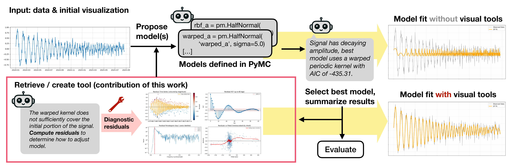
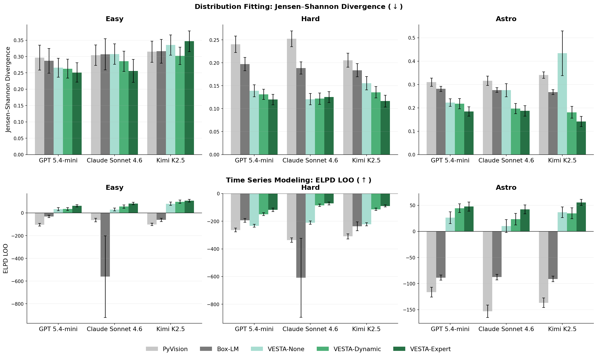
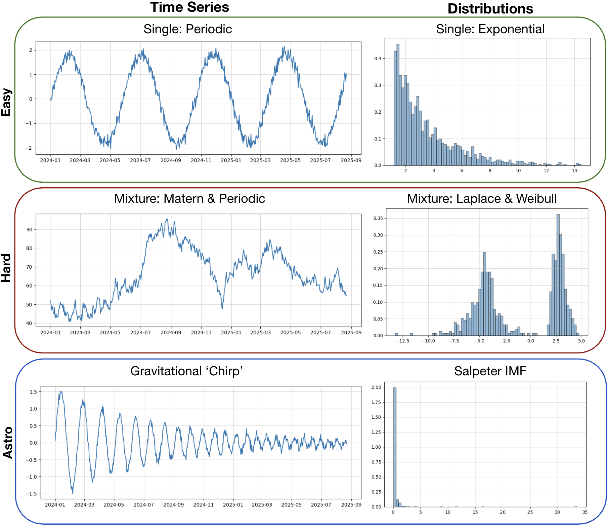

<div align="center">

# VESTA: Visual Exploration with Statistical Tool Agents

Authors: William Rudman\*, Abhishek Divekar\*, Kanishk Jain\*, Sebastian Joseph, Stella S. R. Offner, Matthew Lease, Kyle Mahowald, Greg Durrett, Junyi Jessy Li

<sub>\*Equal contribution. The University of Texas at Austin, New York University.</sub>

[](https://arxiv.org/abs/2606.00384)
[](https://alphaxiv.org/abs/2606.00384)
[](LICENSE)
[](https://www.python.org/downloads/)
[](harbor/tasks/vesta-distribution-fitting/)

</div>

<hr />

## Overview

<p align="center">
  
</p>

> **Abstract:** *Fitting quantitative models to data is a central step in scientific workflows, yet it remains one of the least automated. Recent agent-based systems leverage language and vision-language models (VLMs) to iteratively propose and refine statistical models, but these systems struggle on more challenging modeling tasks. To address these limitations, we introduce VESTA (Visual Exploration with Statistical Tool Agents), a framework that equips VLMs with a dynamically growing exploration toolkit to guide model refinement through data transformations, hypothesis-driven visualizations, and robust statistical tests. Unlike prior systems that rely on iterative critique alone, VESTA actively explores data before and during refinement by selecting or creating diagnostic tools, which accumulate in the model's context and can be reused later. We evaluate VESTA against established baselines in three toolkit configurations: no tools, expert-written tools, and dynamic model-written tools. To support this evaluation, we introduce DAWN (Dataset for Automated Workflows and Numerical Modeling), a benchmark targeting distribution fitting and time series modeling with varying difficulty tiers, and culminating in real-world astronomy tasks including modeling initial mass functions and gravitational-wave chirp signals. We find that VESTA's dynamic tool creation outperforms prior agentic pipelines, with the largest gains on complex and domain-specific tasks. We further show that dynamically generated tools are substantially more sophisticated than those produced by existing visual tool-creation systems, covering more diagnostic categories per function and strongly preferring visual outputs that the VLM critic can reason over directly.*

The figure above shows VESTA's four-phase iteration loop: **Propose** candidate model structures from a data visualization, **Tool Manager** selects an existing diagnostic or dynamically generates a new Python function, **Critique** passes the tool's visual output back to the VLM to refine the model, and **Summarize** compresses each iteration's output so the next prompt can reason over the full trajectory without unbounded context growth.

Key findings:

- **VESTA with expert tools achieves the strongest overall performance** on DAWN, and VESTA with dynamic tools outperforms all prior agentic baselines (PyVision, Box-LM).
- VESTA **independently recovers expert-written tools** and composes them into more sophisticated diagnostics that test multiple hypotheses simultaneously.
- Dynamically generated tools **cover more diagnostic categories** per function and strongly prefer visual outputs that the VLM critic can reason over directly.


## Results

<p align="center">
  
</p>

The figure above shows average Jensen-Shannon divergence on the distribution fitting task (lower is better). VESTA with expert-written tools achieves the strongest overall performance, and VESTA with dynamically generated tools outperforms PyVision and Box-LM across all three difficulty splits (Easy, Hard, Astro).

For time series modeling, we measure Expected Log Predictive Density (ELPD). VESTA outperforms PyVision and Box-LM across all splits, with the largest gains on the Astro split, where the task is to model gravitational-wave chirp signals. The paper reports the full per-LLM results and significance tests.


## DAWN Benchmark

DAWN (Dataset for Automated Workflows and Numerical Modeling) is a benchmark for evaluating automated model fitting systems across two domains central to data science and scientific research.

<p align="center">
  
</p>

### Domains

**Distribution Fitting.** Identify the probability distribution that best explains observed data. Models are specified in PyMC and evaluated by Jensen-Shannon divergence to a ground truth.

**Time Series Modeling.** Construct Gaussian Process models that capture trend, seasonality, and non-stationarity. Models are evaluated by Expected Log Predictive Density (ELPD) on held-out data.

### Difficulty Tiers

Each domain contains three difficulty splits:

- **Easy:** Single, well-known distributions (Gaussian, Lognormal, Student-t, Exponential, Uniform, Weibull, Laplace, Cauchy, Pareto) for distribution fitting; linear trends with simple periodic components for time series.
- **Hard:** Mixtures of two distributions; complex non-linear dynamics including ARIMA, S-curves, ECG signals, and square waves.
- **Astro:** Real-world astronomy tasks drawn from active research:
  - **Initial Mass Functions (IMFs):** Stellar mass distributions modeled by Salpeter, Kroupa, Chabrier, plus two freeform variants (tight and wide broken power laws).
  - **Gravitational Wave Chirps:** Linearly swept-frequency signals from merging binary star systems, with optional inspiral ringdown envelopes.

### Evaluation Metrics

- **Jensen-Shannon Divergence** (distribution fitting): symmetric, bounded in [0, 1], with 0 indicating identical distributions.
- **ELPD LOO** (time series): Expected Log Predictive Density computed via PSIS-LOO cross-validation.

DAWN problems are synthetically generated, so the true data-generating distribution is known and model fit can be measured directly against it. Prior benchmarks often contain only a small number of distributions with few data points; DAWN covers a wider range of families and difficulty.


## Running VESTA

VESTA ships as a [Harbor](https://github.com/harbor-framework/harbor) task. Harbor provides containerized, reproducible environments for running VESTA benchmarks.

### Quickstart

```bash
# Install Harbor
pip install harbor

# Run VESTA on the DAWN distribution fitting task.
# --path points at a local task directory; --agent oracle runs the
# reference solution (solution/solve.sh), which is the VESTA pipeline itself.
harbor run \
    --path harbor/tasks/vesta-distribution-fitting/ \
    --agent oracle \
    --env-file .env
```

`.env` must hold the API keys for your LLM provider (see `.env.example`). The task builds the Docker environment (Python 3.13, PyMC, VESTA, all dependencies), loads the dataset, runs the VLM-guided fitting pipeline, and scores the result with the verifier.

### Choosing a model and overriding LLM params

The reference solution reads two optional environment variables, so you can switch providers/models without editing any code:

| Variable | Purpose | Example |
|---|---|---|
| `VESTA_MODEL_ID` | LiteLLM model string | `openrouter/qwen/qwen3-vl-8b-instruct` |
| `VESTA_LITELLM_PARAMS` | JSON dict forwarded verbatim to the backend | `{"reasoning_effort": "high"}` |

Keys in `VESTA_LITELLM_PARAMS` take precedence over the params VESTA computes from `reasoning_effort`/`api_base`, so you can override or disable any provider-specific behavior. Put both in your `.env` file:

```bash
VESTA_MODEL_ID=bedrock/anthropic.claude-sonnet-4-20250514-v1:0
VESTA_LITELLM_PARAMS={"output_config": {"effort": "low"}}
```

### What the Harbor task does

1. **Builds a container** with Python 3.13, PyMC, and all VESTA dependencies
2. **Loads your dataset** (baked into the container or mounted at runtime)
3. **Runs VESTA's refinement loop**: diagnostic tools → model proposal → code generation → fitting → summary
4. **Verifies results** by checking that VESTA completed successfully and produced a valid report

### Task structure

```
harbor/tasks/vesta-distribution-fitting/
├── task.toml              # Task config (timeouts, resources, metadata)
├── instruction.md         # Natural language instructions for the agent
├── data/data.parquet      # Test dataset
├── environment/Dockerfile # Container image with VESTA + dependencies
├── tests/test.sh          # Verifier (writes reward to /logs/verifier/reward.txt)
└── solution/solve.sh      # Reference implementation
```

## Development

For working on VESTA itself, install from source:

```bash
git clone https://github.com/adivekar-utexas/VESTA
cd VESTA
pip install -e ".[dev]"
```

This installs VESTA as an editable package. The core pipeline lives in
`src/vesta/core/`, with domain-specific code in `src/vesta/domains/`.

## Architecture

VESTA uses vision-language models (VLMs) to iteratively propose, refine, and
evaluate statistical models through dynamic tool creation. The architecture has
four components per iteration:

1.  **Propose:** From a visualization of the data (and previous diagnostic
    outputs), the VLM proposes candidate model structures.
2.  **Tool Manager:** VESTA selects an existing diagnostic tool, or dynamically
    generates Python code for a new one in a sandboxed environment.
3.  **Critique:** The VLM reads the tool's visual output and refines the model
    by proposing revised candidates.
4.  **Summarize:** VESTA compresses each iteration's output into a structured
    summary. The next prompt then reasons over the full refinement trajectory
    without unbounded context growth.

VESTA is built on **PyMC** (probabilistic programming), **LiteLLM + SlowBurn**
(multi-provider LLM orchestration), **Morphic** (Typed + Registry models), and
**Concurry** (parallel execution).

## License

MIT

## Citation

```
@misc{rudman2026vestavisualexplorationstatistical,
      title={VESTA: Visual Exploration with Statistical Tool Agents}, 
      author={William Rudman and Abhishek Divekar and Kanishk Jain and Sebastian Joseph and Stella S. R. Offner and Matthew Lease and Kyle Mahowald and Greg Durrett and Junyi Jessy Li},
      year={2026},
      eprint={2606.00384},
      archivePrefix={arXiv},
      primaryClass={cs.AI},
      url={https://arxiv.org/abs/2606.00384}, 
}
```


## Contact
If you have any questions, please raise an issue or contact us at william.rudman@utexas.edu